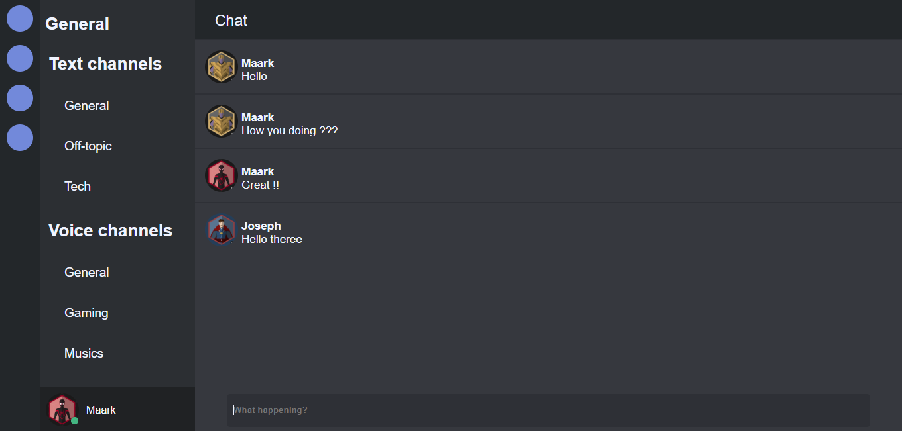

# Real-time-chat

## You can see the app here:

https://whatsapp122.netlify.com/

## Tools used
```
1 - React-js
2 - SASS
3 - Styled-components
```
## Preview 



## How run my app
```
1 - Clone from github.
2 - Run yarn install.
3 - Run yarn start.
4 - Enjoy. 
```
